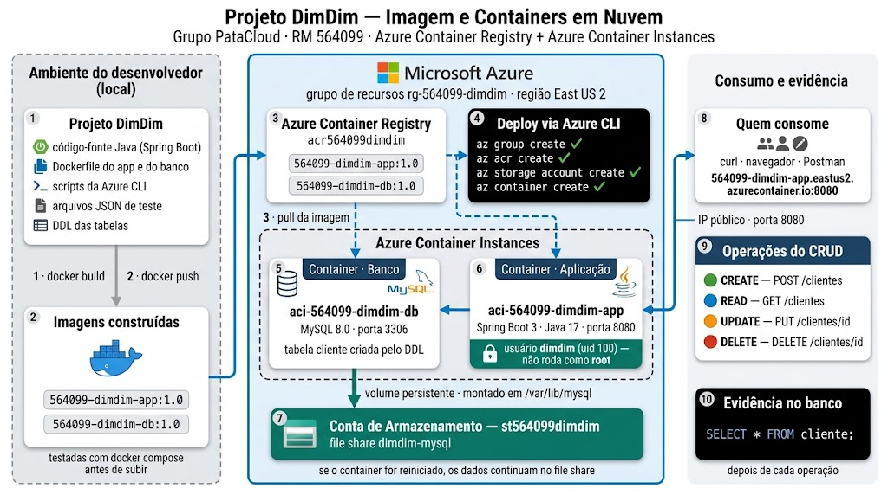
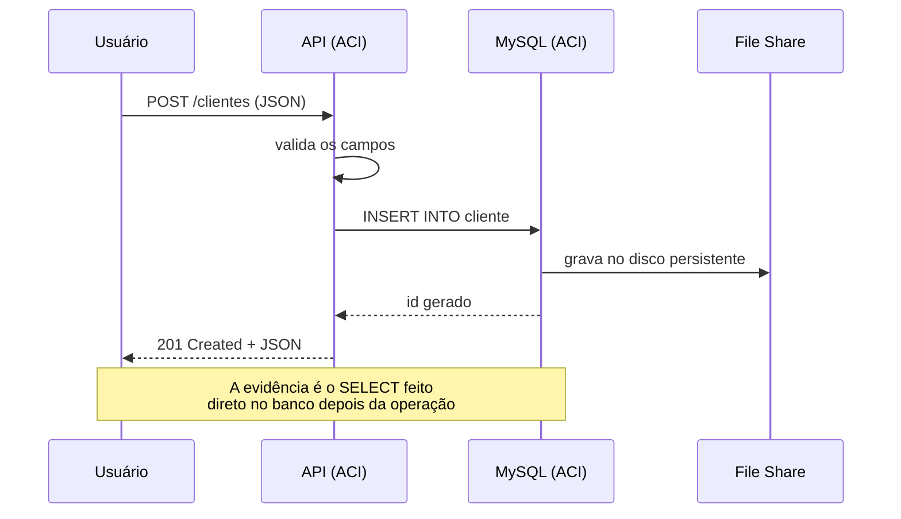

# Projeto DimDim — Containers em Nuvem (ACR + ACI)

Checkpoint de **DevOps Tools & Cloud Computing** — conteinerização de uma API Java
(Spring Boot) e de um banco MySQL, com registro das imagens no **Azure Container
Registry** e execução em **Azure Container Instances**, com os dados do banco
persistidos em uma **Conta de Armazenamento**.

---

## Grupo PataCloud — Turma 2TDSR

| RM | Nome completo |
|---|---|
| 564099 | Natalia Cristina de Souza |
| 564105 | Nickolas Davi Silva Souza |
| 565162 | Rodrigo Carvalho Silva |
| 565960 | Otávio Ferreira Barreto Santos |
| 566133 | Samara Vilela de Oliveira |

**Representante:** Natalia Cristina de Souza — RM 564099
(o RM do representante é o prefixo das imagens e dos ACIs)

**Aplicação no ar:** http://564099-dimdim-app.eastus2.azurecontainer.io:8080/clientes

---

## Arquitetura



Do ambiente local até a nuvem: as imagens são construídas e testadas na máquina,
enviadas ao **Azure Container Registry**, e de lá puxadas pelas duas **Azure
Container Instances**. Os dados do MySQL ficam num **file share** da Conta de
Armazenamento — se o container do banco for reiniciado, os dados continuam lá.

O container da aplicação roda com o usuário `dimdim` (uid 100), **sem privilégio
de administrador**. Todos os recursos foram criados por **Azure CLI**; os scripts
estão em [`scripts/`](scripts/).

---

## O caminho de uma operação do CRUD



O container da aplicação recebe o endereço do banco por variável de ambiente e
**nunca** carrega credenciais no código.

---

## Estrutura do repositório

```
.
├── app/                      API Java (Spring Boot 3 + JPA)
│   ├── Dockerfile            build multi-stage, runtime sem root
│   ├── pom.xml
│   └── src/main/java/br/com/fiap/dimdim/
│       ├── DimdimApplication.java
│       ├── model/Cliente.java
│       ├── repository/ClienteRepository.java
│       └── controller/ClienteController.java
├── db/
│   ├── Dockerfile            MySQL 8.0
│   └── init/01-ddl.sql       DDL das tabelas + carga inicial
├── json/                     arquivos JSON de teste dos 4 verbos
├── scripts/                  todos os recursos criados via Azure CLI
│   ├── 00-variaveis.sh
│   ├── 01-criar-acr.sh
│   ├── 02-build-e-push.sh
│   ├── 03-criar-storage.sh
│   ├── 04-criar-aci-banco.sh
│   ├── 05-criar-aci-app.sh
│   └── 06-testes-crud.sh
├── docker-compose.yml        somente para o teste local
└── .env.exemplo
```

---

## Banco de dados

Uma tabela, `cliente`, criada pelo DDL em `db/init/01-ddl.sql`:

| Coluna | Tipo | Restrição |
|---|---|---|
| `id_cliente` | BIGINT | PK, AUTO_INCREMENT |
| `nm_cliente` | VARCHAR(100) | NOT NULL |
| `nr_cpf` | VARCHAR(11) | NOT NULL, UNIQUE |
| `ds_email` | VARCHAR(120) | NOT NULL |
| `vl_saldo` | DECIMAL(12,2) | NOT NULL, CHECK >= 0 |

A aplicação sobe com `spring.jpa.hibernate.ddl-auto=validate`: quem cria o schema é
o DDL, o Hibernate apenas confere se bate.

---

## API

Base: `http://<fqdn-do-aci-do-app>:8080`

| Método | Rota | Descrição | Corpo |
|---|---|---|---|
| GET | `/clientes` | lista todos | `json/cliente-get.json` |
| GET | `/clientes/{id}` | busca por id | — |
| POST | `/clientes` | insere | `json/cliente-post.json` |
| PUT | `/clientes/{id}` | atualiza | `json/cliente-put.json` |
| DELETE | `/clientes/{id}` | remove | `json/cliente-delete.json` |

---

# How To — execução do zero

## Pré-requisitos

- Docker
- Azure CLI (`az`)
- Uma assinatura Azure ativa

## Passo 0 — credenciais

As senhas **não** estão em nenhum arquivo do repositório. Exporte antes de tudo:

```bash
export DB_ROOT_PASSWORD='SuaSenhaForteDoRoot'
export DB_PASSWORD='SuaSenhaForteDoApp'
```

O RM do representante já está configurado em `scripts/00-variaveis.sh` (564099).

## Passo 1 — teste local

```bash
cp .env.exemplo .env      # preencha as senhas
docker compose build
docker compose up -d
```

Confira que subiu:

```bash
curl http://localhost:8080/clientes
```

CRUD completo local:

```bash
# POST
curl -X POST http://localhost:8080/clientes \
     -H "Content-Type: application/json" \
     -d @json/cliente-post.json

# PUT
curl -X PUT http://localhost:8080/clientes/3 \
     -H "Content-Type: application/json" \
     -d @json/cliente-put.json

# DELETE
curl -X DELETE http://localhost:8080/clientes/3

# SELECT direto no banco (evidencia)
docker exec dimdim-db mysql -u dimdim -p"$DB_PASSWORD" -D dimdim \
    -e "SELECT * FROM cliente;"
```

Confirmando que o app **não** roda como root:

```bash
docker exec dimdim-app whoami     # dimdim
docker exec dimdim-app id         # uid=100(dimdim) gid=101(dimdim)
```

Derrube o ambiente local antes de ir para a nuvem:

```bash
docker compose down
```

## Passo 2 — login na Azure

```bash
az login
az account show
```

## Passo 3 — grupo de recursos e ACR

```bash
bash scripts/01-criar-acr.sh
```

## Passo 4 — build e push das imagens

```bash
bash scripts/02-build-e-push.sh
```

Os comandos executados por dentro são:

```bash
docker build -t <RM>-dimdim-db:1.0  db/
docker build -t <RM>-dimdim-app:1.0 app/

docker tag <RM>-dimdim-db:1.0  <acr>.azurecr.io/<RM>-dimdim-db:1.0
docker tag <RM>-dimdim-app:1.0 <acr>.azurecr.io/<RM>-dimdim-app:1.0

docker push <acr>.azurecr.io/<RM>-dimdim-db:1.0
docker push <acr>.azurecr.io/<RM>-dimdim-app:1.0
```

Conferindo o registro:

```bash
az acr repository list --name <acr> --output table
```

## Passo 5 — conta de armazenamento

```bash
bash scripts/03-criar-storage.sh
```

## Passo 6 — ACI do banco

```bash
bash scripts/04-criar-aci-banco.sh
```

## Passo 7 — ACI da aplicação

```bash
bash scripts/05-criar-aci-app.sh
```

## Passo 8 — testes em nuvem com evidência

```bash
bash scripts/06-testes-crud.sh
```

O script executa cada operação da API e, logo depois, um `SELECT * FROM cliente`
direto no banco, pausando entre as etapas.

## Passo 9 — provar a persistência

```bash
az container restart --resource-group <rg> --name aci-<RM>-dimdim-db
# depois que voltar, o SELECT mostra os mesmos dados:
mysql -h <fqdn-do-banco> -u dimdim -p -D dimdim -e "SELECT * FROM cliente;"
```

---

## Segurança

- Nenhuma senha, chave ou token no código ou no repositório
- Senhas entram nos containers como `--secure-environment-variables`, que não
  aparecem em `az container show` nem no portal
- O `.env` local está no `.gitignore`
- O container da aplicação roda com o usuário `dimdim` (uid 100), sem privilégio
  administrativo

---

## Limpeza

```bash
az group delete --name <rg> --yes --no-wait
```
